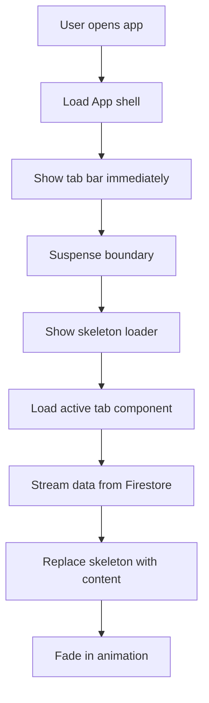
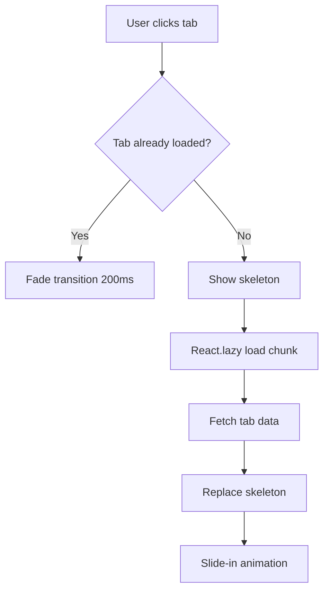
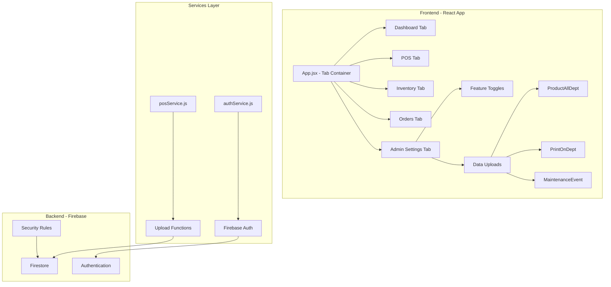

# Boots POS Comprehensive Refactor Plan

**Project:** Boots-POS Gemini  
**Date:** 2025-12-31  
**Scope:** UI/UX Restructuring, Upload System, Animations, Authentication Refactor

---

## 1. Navigation & Layout Restructuring ✅

### Current State

- [`src/components/Layout.jsx`](src/components/Layout.jsx) uses a left sidebar with navigation links
- [`src/components/PosUI.jsx`](src/components/PosUI.jsx) has internal tab switching (Dashboard/POS)
- Top header shows page title and shopping cart icon
- Routes defined in [`src/App.jsx`](src/App.jsx) with React Router

### Target State

**Single-Page Tab Interface** - All navigation consolidated into horizontal tabs at top:

- Remove left sidebar completely
- Remove top header with "POS and shopping cart" text/icon
- Create horizontal tab bar with 5 primary tabs: **Dashboard | POS | Inventory | Orders | Admin Settings**
- Each tab renders its content in the main area below
- Admin Settings becomes a primary tab (not a modal)

### Implementation Strategy

```
┌─────────────────────────────────────────────────────────┐
│  [🏗️ Dashboard] [💻 POS] [📦 Inventory] [📋 Orders] [⚙️ Admin] │
│  Theme Toggle (right corner)                            │
├─────────────────────────────────────────────────────────┤
│                                                         │
│              Active Tab Content Here                    │
│                                                         │
└─────────────────────────────────────────────────────────┘
```

**Changes Required:**

1. **Refactor [`App.jsx`](src/App.jsx)**: Remove `<Layout>` wrapper, remove React Router routes, implement state-based tab switching
2. **Remove [`Layout.jsx`](src/components/Layout.jsx)**: No longer needed
3. **Update [`PosUI.jsx`](src/components/PosUI.jsx)**: Keep POS terminal logic but integrate as tab content (not standalone)
4. **Create new pages:**
   - [`src/pages/DashboardPage.jsx`](src/pages/DashboardPage.jsx) - Dashboard content
   - [`src/pages/InventoryPage.jsx`](src/pages/InventoryPage.jsx) - Inventory management
   - [`src/pages/OrdersPage.jsx`](src/pages/OrdersPage.jsx) - Orders list/management
   - [`src/pages/AdminSettingsPage.jsx`](src/pages/AdminSettingsPage.jsx) - Admin panel with sub-tabs

---

## 2. Font & Typography ✅

### Requirement

Replace all fonts with **Noto Sans Thai** for proper Thai language support.

### Implementation

**File:** [`src/index.css`](src/index.css)

```css
@import url("https://fonts.googleapis.com/css2?family=Noto+Sans+Thai:wght@100;200;300;400;500;600;700;800;900&display=swap");

* {
  font-family:
    "Noto Sans Thai",
    -apple-system,
    BlinkMacSystemFont,
    "Segoe UI",
    sans-serif;
}
```

**Tailwind Config:** [`tailwind.config.js`](tailwind.config.js)

```js
module.exports = {
  theme: {
    extend: {
      fontFamily: {
        sans: ["Noto Sans Thai", "sans-serif"],
      },
    },
  },
};
```

---

## 3. Animation & Streaming Strategy ✅

### Requirements

- Initial page load: streaming with Suspense (show skeleton → fill content)
- Tab transitions: smooth, lightweight, low RAM usage
- Technique: React.lazy + Suspense + framer-motion

### Architecture

#### A. Code Splitting with React.lazy

```jsx
// App.jsx
const DashboardPage = React.lazy(() => import("./pages/DashboardPage"));
const PosUI = React.lazy(() => import("./components/PosUI"));
const InventoryPage = React.lazy(() => import("./pages/InventoryPage"));
const OrdersPage = React.lazy(() => import("./pages/OrdersPage"));
const AdminSettingsPage = React.lazy(() => import("./pages/AdminSettingsPage"));
```

#### B. Suspense Boundaries with Skeletons

```jsx
<Suspense fallback={<TabSkeleton />}>
  {activeTab === "dashboard" && <DashboardPage />}
  {activeTab === "pos" && <PosUI />}
  {activeTab === "inventory" && <InventoryPage />}
  {activeTab === "orders" && <OrdersPage />}
  {activeTab === "admin" && <AdminSettingsPage />}
</Suspense>
```

**Create:** [`src/components/skeletons/TabSkeleton.jsx`](src/components/skeletons/TabSkeleton.jsx)

- Lightweight shimmer effect
- Mimics layout of content being loaded
- No heavy animations

#### C. Tab Transitions with Framer Motion

```jsx
import { motion, AnimatePresence } from "framer-motion";

<AnimatePresence mode="wait">
  <motion.div
    key={activeTab}
    initial={{ opacity: 0, x: 20 }}
    animate={{ opacity: 1, x: 0 }}
    exit={{ opacity: 0, x: -20 }}
    transition={{ duration: 0.2, ease: "easeInOut" }}
  >
    <Suspense fallback={<TabSkeleton />}>{renderActiveTab()}</Suspense>
  </motion.div>
</AnimatePresence>;
```

**Performance Optimizations:**

- `will-change: transform, opacity` (CSS)
- GPU acceleration via transforms (not position)
- Memoize tab components with `React.memo`
- Debounce tab switches if rapid clicking

**Dependencies to Add:**

```json
{
  "framer-motion": "^11.0.0"
}
```

---

## 4. Admin Settings Redesign ✅

### Current State

[`src/components/AdminSettings.jsx`](src/components/AdminSettings.jsx) is a modal with single upload function.

### Target State

**Full-page tab with two sub-tabs:**

```
Admin Settings
├── Feature Toggles (Checkbox Grid)
└── Data Uploads (3 upload types)
```

### A. Feature Toggles Sub-Tab

**Layout:**

```
┌──────────────────────────────────────────┐
│  Feature Management                      │
│  ┌────────────────────────────────────┐  │
│  │ ☑ Enable Multi-Store Mode         │  │
│  │ ☐ Enable Advanced Promotions      │  │
│  │ ☑ Enable Coupon Scanning          │  │
│  │ ☐ Enable Void by Manager Only     │  │
│  │ ☑ Enable Daily Report Auto-send   │  │
│  │ ☐ Enable Low Stock Alerts         │  │
│  │ ☑ Enable Thai Language Priority   │  │
│  └────────────────────────────────────┘  │
│  [Save Settings]                         │
└──────────────────────────────────────────┘
```

**Storage:**

- Firestore collection: `appSettings/features`
- Document structure:

```js
{
  multiStoreMode: true,
  advancedPromotions: false,
  couponScanning: true,
  voidManagerOnly: false,
  autoReport: true,
  lowStockAlerts: false,
  thaiLanguagePriority: true,
  updatedAt: Timestamp,
  updatedBy: "admin@boots.com"
}
```

### B. Data Uploads Sub-Tab

**Three Upload Sections:**

1. **ProductAllDept** (Master Data) - Required First
2. **ItemMasterPrintOnDept** (Print Data) - Optional
3. **ItemMaintananceEvent** (Maintenance Data) - Optional

**Layout:**

```
┌─────────────────────────────────────────────────────┐
│  Data Uploads                                       │
│  ┌───────────────────────────────────────────────┐  │
│  │ 1. ProductAllDept (Master) - REQUIRED         │  │
│  │    Status: ✓ Uploaded | 12,543 items         │  │
│  │    Last Update: 2025-12-30 14:23:15          │  │
│  │    [📤 Upload New File]                       │  │
│  └───────────────────────────────────────────────┘  │
│  ┌───────────────────────────────────────────────┐  │
│  │ 2. ItemMasterPrintOnDept                     │  │
│  │    Status: ⚠ Not uploaded                    │  │
│  │    [📤 Upload] (disabled until master done)  │  │
│  └───────────────────────────────────────────────┘  │
│  ┌───────────────────────────────────────────────┐  │
│  │ 3. ItemMaintananceEvent                      │  │
│  │    Status: ⚠ Not uploaded                    │  │
│  │    [📤 Upload] (disabled until master done)  │  │
│  └───────────────────────────────────────────────┘  │
└─────────────────────────────────────────────────────┘
```

**Gating Logic:**

```js
const canUploadPrint = uploadMetadata?.ProductAllDept?.uploaded === true;
const canUploadMaint = uploadMetadata?.ProductAllDept?.uploaded === true;
```

---

## 5. ProductAllDept Upload Specification ✅

### UX Flow

#### Step 1: File Selection

```
┌────────────────────────────────────────┐
│  Drop file or click to browse         │
│  Accepts: .xlsx, .xls, .csv            │
│  Max size: 50 MB                       │
└────────────────────────────────────────┘
```

#### Step 2: Validation & Preview

```
┌────────────────────────────────────────┐
│  File: ProductAllDept_20251230.xlsx    │
│  Detected Rows: 15,234                 │
│  Valid Products (Status=0): 12,543     │
│  Invalid/Skipped: 2,691                │
│  [Cancel] [Proceed to Upload]          │
└────────────────────────────────────────┘
```

#### Step 3: Upload Progress

```
┌────────────────────────────────────────┐
│  Uploading... 45%                      │
│  ▓▓▓▓▓▓▓▓▓░░░░░░░░░░                 │
│  Processed: 5,644 / 12,543             │
│  Success: 5,640 | Failed: 4            │
│  Elapsed: 1m 23s | Remaining: ~2m     │
└────────────────────────────────────────┘
```

#### Step 4: Completion Summary

```
┌────────────────────────────────────────┐
│  ✓ Upload Complete!                    │
│  Total Items: 12,543                   │
│  Successfully Imported: 12,539         │
│  Failed: 4                             │
│  [View Error Log] [Close]              │
└────────────────────────────────────────┘
```

### Backend Implementation

**Service:** [`src/services/posService.js`](src/services/posService.js)

```js
uploadProductAllDept: async (file, onProgress) => {
  // 1. Parse file (XLSX/CSV)
  const buffer = await file.arrayBuffer();
  const workbook = XLSX.read(buffer);
  const rows = XLSX.utils.sheet_to_json(
    workbook.Sheets[workbook.SheetNames[0]],
  );

  // 2. Filter ProductStatus = '0'
  const validProducts = rows.filter((row) =>
    String(row["ProductStatus"] || "")
      .trim()
      .startsWith("0"),
  );

  onProgress({ phase: "Validating", percent: 10, total: validProducts.length });

  // 3. Batch upsert to Firestore
  const BATCH_SIZE = 500;
  let batches = [];
  let currentBatch = writeBatch(db);
  let count = 0;

  for (const row of validProducts) {
    const productCode = String(
      row["ProductCode"] || row["GridProductCode"],
    ).trim();
    if (!productCode) continue;

    const docRef = doc(db, "products", productCode);
    const data = {
      ProductCode: productCode,
      Barcode: String(row["Barcode"] || "").trim(),
      ProductDesc: String(row["ProductDesc"] || "").trim(),
      SellPrice: parseFloat(row["SellPrice"] || 0),
      VatRate: parseFloat(row["VatRate"] || 0),
      ProductStatus: row["ProductStatus"],
      DeptCode: row["DeptCode"],
      GroupCode: row["GroupCode"],
      ...row,
      keywords: generateKeywords(row["ProductDesc"]), // For search
      updatedAt: serverTimestamp(),
      uploadSource: "ProductAllDept",
    };

    currentBatch.set(docRef, data, { merge: true });
    count++;

    if (count >= BATCH_SIZE) {
      batches.push(currentBatch);
      currentBatch = writeBatch(db);
      count = 0;
    }
  }

  if (count > 0) batches.push(currentBatch);

  // 4. Execute batches with progress
  for (let i = 0; i < batches.length; i++) {
    await batches[i].commit();
    const percent = 10 + Math.floor((i / batches.length) * 90);
    onProgress({
      phase: "Uploading",
      percent,
      processed: (i + 1) * BATCH_SIZE,
      total: validProducts.length,
    });
  }

  // 5. Store metadata
  await setDoc(doc(db, "uploadMetadata", "ProductAllDept"), {
    uploaded: true,
    itemCount: validProducts.length,
    uploadedAt: serverTimestamp(),
    fileName: file.name,
    fileSize: file.size,
  });

  return { success: validProducts.length };
};
```

### Metadata Storage

**Firestore Collection:** `uploadMetadata`

```js
{
  ProductAllDept: {
    uploaded: true,
    itemCount: 12543,
    uploadedAt: Timestamp(2025-12-30T14:23:15Z),
    fileName: "ProductAllDept_20251230.xlsx",
    fileSize: 3457821,
    lastError: null
  },
  ItemMasterPrintOnDept: {
    uploaded: false,
    itemCount: 0,
    uploadedAt: null
  },
  ItemMaintananceEvent: {
    uploaded: false,
    itemCount: 0,
    uploadedAt: null
  }
}
```

---

## 6. ItemMasterPrintOnDept Upload Specification ✅

### Column Mapping

**Excel Columns → Firestore Fields:**

| Excel Col | Index | Field Name  | Example               |
| --------- | ----- | ----------- | --------------------- |
| B         | 1     | ItemCode    | "7531745"             |
| F         | 5     | Description | "BTS SCISSORS CURVED" |
| L         | 11    | Dept        | "01"                  |
| N         | 13    | Class       | "001"                 |
| U         | 20    | Merchandise | "Beauty"              |
| Y         | 24    | RegPrice    | 139.00                |
| AD        | 29    | Method      | "RETAIL"              |
| AF        | 31    | UnitPrice   | 139.00                |
| AJ        | 35    | DealPrice   | 99.00                 |
| AO        | 40    | DealQty     | 2                     |
| AS        | 44    | Limit       | 4                     |
| AV        | 47    | MPG         | "MPG01"               |
| AY        | 50    | Tax         | 7                     |
| BB        | 53    | Brand       | "BOOTS"               |

### Processing Logic

```js
uploadItemMasterPrintOnDept: async (file, onProgress) => {
  // 1. Check gating
  const metadata = await getDoc(doc(db, "uploadMetadata", "ProductAllDept"));
  if (!metadata.exists() || !metadata.data().uploaded) {
    throw new Error("Must upload ProductAllDept first");
  }

  // 2. Parse file (.xls format)
  const workbook = XLSX.read(await file.arrayBuffer());
  const sheet = workbook.Sheets[workbook.SheetNames[0]];
  const rows = XLSX.utils.sheet_to_json(sheet, { header: 1 });

  let successCount = 0;
  let skippedCount = 0;
  const errors = [];

  // 3. Process rows
  for (const row of rows.slice(1)) {
    // Skip header
    const itemCode = String(row[1] || "").trim(); // Column B
    if (!itemCode) continue;

    // 4. Check if product exists
    const productRef = doc(db, "products", itemCode);
    const productSnap = await getDoc(productRef);

    if (!productSnap.exists()) {
      skippedCount++;
      errors.push(`Product ${itemCode} not found in master data`);
      continue;
    }

    // 5. Merge print data
    await updateDoc(productRef, {
      description_print: row[5],
      dept_print: row[11],
      class_print: row[13],
      merchandise_print: row[20],
      regPrice_print: row[24],
      method_print: row[29],
      unitPrice_print: row[31],
      dealPrice_print: row[35],
      dealQty_print: row[40],
      limit_print: row[44],
      mpg_print: row[47],
      tax_print: row[50],
      brand_print: row[53],
      printData_updatedAt: serverTimestamp(),
    });

    successCount++;
    onProgress({
      processed: successCount + skippedCount,
      total: rows.length - 1,
    });
  }

  // 6. Update metadata
  await setDoc(doc(db, "uploadMetadata", "ItemMasterPrintOnDept"), {
    uploaded: true,
    itemCount: successCount,
    skipped: skippedCount,
    uploadedAt: serverTimestamp(),
    fileName: file.name,
  });

  return { success: successCount, skipped: skippedCount, errors };
};
```

---

## 7. ItemMaintananceEvent Upload Specification ✅

### Column Mapping

| Excel Col | Index | Field Name  | Example        |
| --------- | ----- | ----------- | -------------- |
| B         | 1     | ItemCode    | "7531745"      |
| F         | 5     | Description | "BTS SCISSORS" |
| L         | 11    | Type        | "REGULAR"      |
| N         | 13    | Dept        | "01"           |
| R         | 17    | Class       | "001"          |
| V         | 21    | RegPrice    | 139.00         |
| Y         | 24    | Method      | "RETAIL"       |
| AB        | 27    | UnitPrice   | 139.00         |
| AF        | 31    | DealPrice   | 99.00          |
| AL        | 37    | DealQty     | 2              |
| AQ        | 42    | LimitQty    | 4              |
| AT        | 45    | MPGroup     | "MPG01"        |

### Processing Logic

```js
uploadItemMaintananceEvent: async (file, onProgress) => {
  // 1. Gating check (same as print)
  const metadata = await getDoc(doc(db, "uploadMetadata", "ProductAllDept"));
  if (!metadata.exists() || !metadata.data().uploaded) {
    throw new Error("Must upload ProductAllDept first");
  }

  // 2. Parse file
  const workbook = XLSX.read(await file.arrayBuffer());
  const rows = XLSX.utils.sheet_to_json(
    workbook.Sheets[workbook.SheetNames[0]],
    { header: 1 },
  );

  let successCount = 0;
  let skippedCount = 0;

  // 3. Process rows
  for (const row of rows.slice(1)) {
    const itemCode = String(row[1] || "").trim();
    if (!itemCode) continue;

    const productRef = doc(db, "products", itemCode);
    const productSnap = await getDoc(productRef);

    if (!productSnap.exists()) {
      skippedCount++;
      continue;
    }

    // 4. Merge maintenance data
    await updateDoc(productRef, {
      description_maint: row[5],
      type_maint: row[11],
      dept_maint: row[13],
      class_maint: row[17],
      regPrice_maint: row[21],
      method_maint: row[24],
      unitPrice_maint: row[27],
      dealPrice_maint: row[31],
      dealQty_maint: row[37],
      limitQty_maint: row[42],
      mpGroup_maint: row[45],
      maintData_updatedAt: serverTimestamp(),
    });

    successCount++;
    onProgress({
      processed: successCount + skippedCount,
      total: rows.length - 1,
    });
  }

  // 5. Update metadata
  await setDoc(doc(db, "uploadMetadata", "ItemMaintananceEvent"), {
    uploaded: true,
    itemCount: successCount,
    skipped: skippedCount,
    uploadedAt: serverTimestamp(),
    fileName: file.name,
  });

  return { success: successCount, skipped: skippedCount };
};
```

---

## 8. Autocomplete Search in Upload Page ✅

### Requirement

Display autocomplete dropdown in upload pages when user types product search.

### Implementation

**Component:** [`src/components/ProductAutocomplete.jsx`](src/components/ProductAutocomplete.jsx)

```jsx
import { useState, useEffect } from "react";
import { posService } from "../services/posService";

export default function ProductAutocomplete({ onSelect }) {
  const [query, setQuery] = useState("");
  const [results, setResults] = useState([]);
  const [showDropdown, setShowDropdown] = useState(false);

  useEffect(() => {
    const timer = setTimeout(async () => {
      if (query.length >= 2) {
        const products = await posService.searchProducts(query);
        setResults(products);
        setShowDropdown(true);
      } else {
        setResults([]);
        setShowDropdown(false);
      }
    }, 300);

    return () => clearTimeout(timer);
  }, [query]);

  return (
    <div className="relative">
      <input
        type="text"
        value={query}
        onChange={(e) => setQuery(e.target.value)}
        placeholder="Search products..."
        className="w-full px-4 py-2 border rounded-lg"
      />

      {showDropdown && results.length > 0 && (
        <div className="absolute z-50 w-full mt-1 bg-white border rounded-lg shadow-lg max-h-64 overflow-y-auto">
          {results.map((product) => (
            <div
              key={product.sku}
              onClick={() => {
                onSelect(product);
                setShowDropdown(false);
                setQuery("");
              }}
              className="p-3 hover:bg-gray-100 cursor-pointer border-b"
            >
              <div className="font-bold text-gray-800">{product.name}</div>
              <div className="text-sm text-gray-500">SKU: {product.sku}</div>
              <div className="text-lg font-bold text-blue-600">
                ฿{product.price.toLocaleString()}
              </div>
            </div>
          ))}
        </div>
      )}
    </div>
  );
}
```

**Usage in Upload Pages:**

```jsx
<ProductAutocomplete
  onSelect={(product) => {
    console.log("Selected:", product);
    // Use for validation or preview
  }}
/>
```

---

## 9. Page Load & Tab Transition Flows ✅

### A. Initial App Load



### B. Tab Switch Flow



### C. Implementation Strategy

**1. Preload Next Likely Tab**

```jsx
useEffect(() => {
  // Preload adjacent tabs on hover
  const preloadTab = (tabName) => {
    if (tabName === "pos") import("./components/PosUI");
    if (tabName === "inventory") import("./pages/InventoryPage");
  };

  // Attach to tab hover events
}, []);
```

**2. Streaming Data Pattern**

```jsx
function DashboardPage() {
  const [criticalData, setCriticalData] = useState(null);
  const [secondaryData, setSecondaryData] = useState(null);

  useEffect(() => {
    // Load critical data first
    fetchCriticalData().then(setCriticalData);

    // Load secondary data after
    setTimeout(() => {
      fetchSecondaryData().then(setSecondaryData);
    }, 500);
  }, []);

  return (
    <div>
      {criticalData ? <CriticalSection data={criticalData} /> : <Skeleton />}
      {secondaryData ? <SecondarySection data={secondaryData} /> : <Skeleton />}
    </div>
  );
}
```

**3. Skeleton Components**

Create reusable skeletons:

- [`src/components/skeletons/TabSkeleton.jsx`](src/components/skeletons/TabSkeleton.jsx)
- [`src/components/skeletons/TableSkeleton.jsx`](src/components/skeletons/TableSkeleton.jsx)
- [`src/components/skeletons/CardSkeleton.jsx`](src/components/skeletons/CardSkeleton.jsx)

```jsx
// TabSkeleton.jsx
export default function TabSkeleton() {
  return (
    <div className="animate-pulse p-6">
      <div className="h-8 bg-gray-200 rounded w-1/4 mb-4"></div>
      <div className="h-64 bg-gray-200 rounded"></div>
    </div>
  );
}
```

---

## 10. Authentication Refactor ✅

### Current State

[`src/services/authService.js`](src/services/authService.js) has basic Firebase Auth stub.

### Target Architecture

```
┌─────────────────────────────────────────┐
│  Authentication Flow                    │
├─────────────────────────────────────────┤
│  1. Login Page (email/password)         │
│  2. Firebase Auth sign-in               │
│  3. Check user role in Firestore        │
│  4. Set AuthContext (user + role)       │
│  5. Route guards check permissions      │
│  6. Token refresh on expiry             │
└─────────────────────────────────────────┘
```

### Implementation Plan

#### A. Auth Context

**Create:** [`src/context/AuthContext.jsx`](src/context/AuthContext.jsx)

```jsx
import { createContext, useContext, useState, useEffect } from "react";
import { auth } from "../lib/firebase";
import { onAuthStateChanged } from "firebase/auth";
import { doc, getDoc } from "firebase/firestore";
import { db } from "../lib/firebase";

const AuthContext = createContext();

export function AuthProvider({ children }) {
  const [user, setUser] = useState(null);
  const [role, setRole] = useState(null);
  const [loading, setLoading] = useState(true);

  useEffect(() => {
    const unsubscribe = onAuthStateChanged(auth, async (firebaseUser) => {
      if (firebaseUser) {
        // Fetch user role from Firestore
        const userDoc = await getDoc(doc(db, "users", firebaseUser.uid));
        const userData = userDoc.data();

        setUser(firebaseUser);
        setRole(userData?.role || "cashier");
      } else {
        setUser(null);
        setRole(null);
      }
      setLoading(false);
    });

    return unsubscribe;
  }, []);

  return (
    <AuthContext.Provider value={{ user, role, loading }}>
      {children}
    </AuthContext.Provider>
  );
}

export const useAuth = () => useContext(AuthContext);
```

#### B. Login Page

**Create:** [`src/pages/LoginPage.jsx`](src/pages/LoginPage.jsx)

```jsx
import { useState } from "react";
import { signInWithEmailAndPassword } from "firebase/auth";
import { auth } from "../lib/firebase";
import { useNavigate } from "react-router-dom";

export default function LoginPage() {
  const [email, setEmail] = useState("");
  const [password, setPassword] = useState("");
  const [error, setError] = useState("");
  const navigate = useNavigate();

  const handleLogin = async (e) => {
    e.preventDefault();
    try {
      await signInWithEmailAndPassword(auth, email, password);
      navigate("/");
    } catch (err) {
      setError("Invalid credentials");
    }
  };

  return (
    <div className="min-h-screen flex items-center justify-center bg-gray-100">
      <form
        onSubmit={handleLogin}
        className="bg-white p-8 rounded-lg shadow-lg w-96"
      >
        <h2 className="text-2xl font-bold mb-6">Boots POS Login</h2>
        {error && <div className="text-red-500 mb-4">{error}</div>}
        <input
          type="email"
          value={email}
          onChange={(e) => setEmail(e.target.value)}
          placeholder="Email"
          className="w-full px-4 py-2 border rounded mb-4"
        />
        <input
          type="password"
          value={password}
          onChange={(e) => setPassword(e.target.value)}
          placeholder="Password"
          className="w-full px-4 py-2 border rounded mb-4"
        />
        <button
          type="submit"
          className="w-full bg-blue-600 text-white py-2 rounded"
        >
          Login
        </button>
      </form>
    </div>
  );
}
```

#### C. Route Guards

**Create:** [`src/components/ProtectedRoute.jsx`](src/components/ProtectedRoute.jsx)

```jsx
import { useAuth } from "../context/AuthContext";
import { Navigate } from "react-router-dom";

export default function ProtectedRoute({ children, requiredRole }) {
  const { user, role, loading } = useAuth();

  if (loading) return <div>Loading...</div>;
  if (!user) return <Navigate to="/login" />;
  if (requiredRole && role !== requiredRole && role !== "admin") {
    return <div>Access Denied</div>;
  }

  return children;
}
```

**Usage:**

```jsx
<Route
  path="/admin"
  element={
    <ProtectedRoute requiredRole="admin">
      <AdminSettingsPage />
    </ProtectedRoute>
  }
/>
```

#### D. Firestore Security Rules

**File:** `firestore.rules`

```
rules_version = '2';
service cloud.firestore {
  match /databases/{database}/documents {

    // Users collection - only authenticated users can read their own data
    match /users/{userId} {
      allow read: if request.auth.uid == userId;
      allow write: if request.auth.uid == userId || get(/databases/$(database)/documents/users/$(request.auth.uid)).data.role == 'admin';
    }

    // Products - cashiers can read, only admins can write
    match /products/{productId} {
      allow read: if request.auth != null;
      allow write: if get(/databases/$(database)/documents/users/$(request.auth.uid)).data.role == 'admin';
    }

    // Upload metadata - only admins
    match /uploadMetadata/{docId} {
      allow read: if request.auth != null;
      allow write: if get(/databases/$(database)/documents/users/$(request.auth.uid)).data.role == 'admin';
    }

    // App settings - only admins
    match /appSettings/{docId} {
      allow read: if request.auth != null;
      allow write: if get(/databases/$(database)/documents/users/$(request.auth.uid)).data.role == 'admin';
    }

    // Invoices - authenticated users can create, read own
    match /invoices/{invoiceId} {
      allow read: if request.auth != null;
      allow create: if request.auth != null;
      allow update, delete: if get(/databases/$(database)/documents/users/$(request.auth.uid)).data.role == 'admin';
    }
  }
}
```

#### E. User Roles Structure

**Firestore Collection:** `users`

```js
{
  "userId123": {
    email: "cashier@boots.com",
    role: "cashier", // or "manager" or "admin"
    storeId: "4340",
    displayName: "Staff #01",
    createdAt: Timestamp,
    lastLogin: Timestamp
  }
}
```

#### F. Token Refresh Strategy

Firebase Auth handles token refresh automatically. For manual checks:

```js
useEffect(() => {
  const interval = setInterval(
    async () => {
      if (auth.currentUser) {
        await auth.currentUser.getIdToken(true); // Force refresh
      }
    },
    55 * 60 * 1000,
  ); // Every 55 minutes

  return () => clearInterval(interval);
}, []);
```

---

## 11. QA & Testing Plan ✅

### A. Sample Files Preparation

**Create test files:**

1. `test-files/ProductAllDept_sample.xlsx` - 100 rows, mixed valid/invalid
2. `test-files/ItemMasterPrintOnDept_sample.xls` - 50 rows
3. `test-files/ItemMaintananceEvent_sample.xlsx` - 50 rows

**Test Cases:**

- ✅ Valid file with all correct data
- ❌ Empty file
- ❌ Wrong headers/columns
- ❌ Mixed valid/invalid ProductStatus
- ❌ Duplicate product codes
- ❌ File size > 50 MB
- ❌ Corrupted file
- ✅ Large file (10,000+ rows) - performance test

### B. Upload Testing Checklist

**ProductAllDept:**

- [ ] Rejects upload without .xlsx/.xls/.csv extension
- [ ] Shows validation errors for missing ProductCode
- [ ] Filters out non-zero ProductStatus
- [ ] Updates existing products (upsert)
- [ ] Generates keywords correctly
- [ ] Stores metadata with correct timestamp
- [ ] Progress bar updates smoothly
- [ ] Error log displays failures

**ItemMasterPrintOnDept:**

- [ ] Blocked if ProductAllDept not uploaded
- [ ] Maps columns B,F,L,N,U,Y,AD,AF,AJ,AO,AS,AV,AY,BB correctly
- [ ] Skips products not in master
- [ ] Shows skipped count in summary

**ItemMaintananceEvent:**

- [ ] Blocked if ProductAllDept not uploaded
- [ ] Maps columns B,F,L,N,R,V,Y,AB,AF,AL,AQ,AT correctly
- [ ] Merges data without overwriting master fields

### C. Animation/Performance Testing

**Metrics:**

- [ ] Initial load < 2 seconds (with cache)
- [ ] Tab switch < 300ms (already loaded)
- [ ] Tab switch < 1 second (lazy load)
- [ ] No memory leaks after 10+ tab switches
- [ ] RAM usage stays < 150 MB (DevTools)
- [ ] No layout shift during skeleton → content transition

**Tools:**

- Chrome DevTools Performance tab
- React DevTools Profiler
- Lighthouse audit

### D. Thai Font Testing

**Verify:**

- [ ] Thai characters render correctly across all pages
- [ ] Font weight variations (100-900) display properly
- [ ] No fallback to system font
- [ ] Consistent spacing and line height

**Test Strings:**

```
สแกนบาร์โค้ด...
ตะกร้าว่างเปล่า
รายการขาย
ส่วนลด
```

### E. Auth Testing

**Scenarios:**

- [ ] Login with valid credentials
- [ ] Login with invalid credentials
- [ ] Logout and session clear
- [ ] Role-based access (cashier cannot access Admin)
- [ ] Token refresh after 55 minutes
- [ ] Protected routes redirect to login
- [ ] Firestore rules block unauthorized writes

### F. Cross-Browser Testing

**Browsers:**

- [ ] Chrome (latest)
- [ ] Firefox (latest)
- [ ] Edge (latest)
- [ ] Safari (if applicable)

### G. Accessibility Checklist

- [ ] Keyboard navigation works for all tabs
- [ ] Focus indicators visible
- [ ] ARIA labels for icons
- [ ] Screen reader compatibility
- [ ] Color contrast meets WCAG AA

---

## 12. Implementation Roadmap

### Phase 1: Foundation (Week 1)

- [x] Install dependencies (framer-motion)
- [ ] Apply Noto Sans Thai font globally
- [ ] Remove Layout.jsx sidebar
- [ ] Create tab-based navigation in App.jsx
- [ ] Implement React.lazy + Suspense for tabs
- [ ] Create skeleton components

### Phase 2: Admin Settings (Week 2)

- [ ] Build AdminSettingsPage with sub-tabs
- [ ] Implement Feature Toggles UI
- [ ] Create upload panel layout with 3 sections
- [ ] Add upload metadata display
- [ ] Implement gating logic

### Phase 3: Upload Backend (Week 2-3)

- [ ] Refactor posService.uploadProductAllDept
- [ ] Add posService.uploadItemMasterPrintOnDept
- [ ] Add posService.uploadItemMaintananceEvent
- [ ] Implement metadata storage
- [ ] Add progress tracking

### Phase 4: UX Polish (Week 3)

- [ ] Build ProductAutocomplete component
- [ ] Add framer-motion transitions
- [ ] Create upload progress bars
- [ ] Add error handling UI
- [ ] Test streaming/skeleton flow

### Phase 5: Authentication (Week 4)

- [ ] Create AuthContext
- [ ] Build LoginPage
- [ ] Add ProtectedRoute guards
- [ ] Update Firestore security rules
- [ ] Implement token refresh

### Phase 6: Testing & Deployment (Week 4)

- [ ] Prepare sample test files
- [ ] Run full QA checklist
- [ ] Performance optimization
- [ ] Cross-browser testing
- [ ] Deploy to production

---

## Technical Dependencies

```json
{
  "dependencies": {
    "react": "^18.2.0",
    "react-dom": "^18.2.0",
    "react-router-dom": "^6.20.0",
    "firebase": "^10.7.0",
    "framer-motion": "^11.0.0",
    "xlsx": "^0.18.5",
    "lucide-react": "^0.294.0"
  }
}
```

---

## Architecture Diagram



---

## Files to Create/Modify

### Create New Files:

1. [`src/pages/DashboardPage.jsx`](src/pages/DashboardPage.jsx)
2. [`src/pages/InventoryPage.jsx`](src/pages/InventoryPage.jsx)
3. [`src/pages/OrdersPage.jsx`](src/pages/OrdersPage.jsx)
4. [`src/pages/AdminSettingsPage.jsx`](src/pages/AdminSettingsPage.jsx)
5. [`src/pages/LoginPage.jsx`](src/pages/LoginPage.jsx)
6. [`src/components/ProductAutocomplete.jsx`](src/components/ProductAutocomplete.jsx)
7. [`src/components/ProtectedRoute.jsx`](src/components/ProtectedRoute.jsx)
8. [`src/components/skeletons/TabSkeleton.jsx`](src/components/skeletons/TabSkeleton.jsx)
9. [`src/components/skeletons/TableSkeleton.jsx`](src/components/skeletons/TableSkeleton.jsx)
10. [`src/context/AuthContext.jsx`](src/context/AuthContext.jsx)

### Modify Existing Files:

1. [`src/App.jsx`](src/App.jsx) - Remove router, add tab logic
2. [`src/index.css`](src/index.css) - Add Noto Sans Thai font
3. [`tailwind.config.js`](tailwind.config.js) - Configure font
4. [`src/services/posService.js`](src/services/posService.js) - Add upload functions
5. [`src/services/authService.js`](src/services/authService.js) - Enhance auth logic
6. [`firestore.rules`](firestore.rules) - Add security rules

### Delete Files:

1. [`src/components/Layout.jsx`](src/components/Layout.jsx) - No longer needed

---

## Success Criteria

✅ Navigation: All 5 tabs accessible from top bar, no sidebar  
✅ Font: Thai text renders with Noto Sans Thai  
✅ Animation: Smooth tab transitions, skeleton → content streaming  
✅ Uploads: 3 upload types work with gating, progress, metadata  
✅ Search: Autocomplete shows product + bold price  
✅ Auth: Login required, role-based access to Admin  
✅ Performance: < 150 MB RAM, < 2s initial load  
✅ Tests: All QA checklist items pass

---

**Plan Complete. Ready for implementation.**
