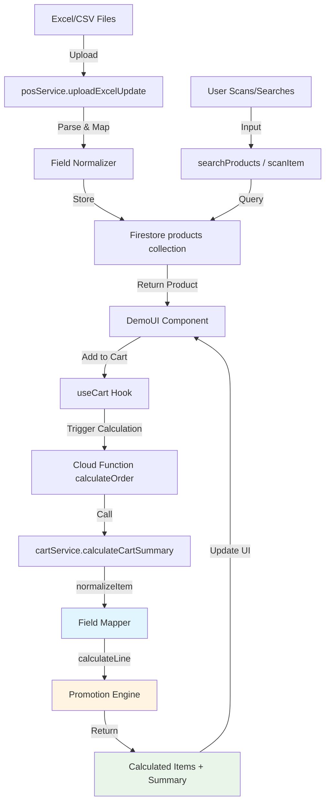
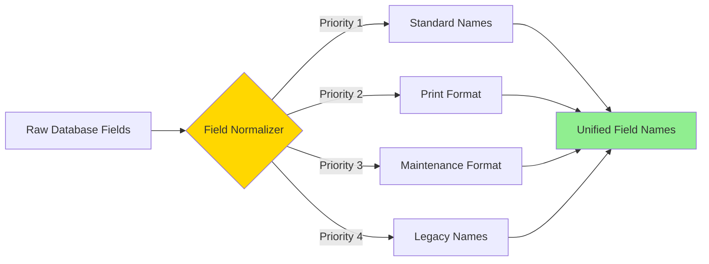

# POS System Enhancement Plan
**Golden Version Enhancement - Data Mapping & UI Improvements**

## 📋 Executive Summary

This plan outlines the incremental enhancement of the existing "Golden Version" POS system to support:
1. **Non-standard database field names** (DESCRIPTION PRINT, REG PRICE, DEAL PRICE, DEAL QTY)
2. **Three promotion methods**: Method 1 (Special Price), Method 8 (Buy N Get 1 Free), Method 9 (Bundle Price)
3. **Enhanced search UX**: Google-style search box with keyboard navigation
4. **Visual distinction**: Blue badges for Method 8, orange for others
5. **Mobile-responsive layout**: Tab-based navigation for mobile devices

---

## 🎯 Core Objectives

### 1. Data Layer Enhancement
- Support multiple field name variations from different data sources
- Ensure backward compatibility with existing field names
- Maintain data integrity during mapping process

### 2. Promotion Calculation Accuracy
- Verify Method 8 calculation: Buy N items, pay for (N-1)
- Verify Method 9 calculation: Buy N items at bundle price
- Verify Method 1 calculation: Direct price substitution

### 3. User Experience Improvements
- Modern search interface with dropdown navigation
- Visual promotion indicators with color coding
- Mobile-first responsive design

---

## 📊 Current State Analysis

### Database Field Structure

Based on code analysis, the system currently handles fields from multiple sources:

**Source 1: ProductAllDept (Master CSV)**
```
- GridProductCode / ProductCode (ID)
- ProductDesc (Name)
- SellPrice (Regular Price)
- Barcode
- ProductStatus
```

**Source 2: ItemMasterPrintOnDeph (Excel)**
```
- Column B (Index 1): Item Code
- Column F (Index 5): description_print → DESCRIPTION (PRINT)
- Column Y (Index 24): regPrice_print → REG PRICE
- Column AD (Index 29): method_print → METHOD
- Column AF (Index 31): unitPrice_print → UNIT PRICE
- Column AJ (Index 35): dealPrice_print → DEAL PRICE
- Column AO (Index 40): dealQty_print → DEAL QTY
```

**Source 3: ItemMaintananceEvent (Excel)**
```
- Similar structure with _maint suffix
- method_maint, dealPrice_maint, dealQty_maint
```

### Current Promotion Logic

**Server-side calculation** (functions/src/services/cartService.js):
- ✅ Method 8: Implemented correctly
- ✅ Method 9: Implemented correctly  
- ✅ Method 1: Implemented correctly
- ✅ Badge generation: Implemented with Thai text

**Field Mapping** (normalizeItem function):
```javascript
unitPrice: parseFloat(getVal(['unitPrice', 'UnitPrice', 'SellPrice', 'regPrice', 'RegPrice']))
method: String(getVal(['method', 'Method', 'method_maint', 'Method_maint']))
dealQty: parseInt(getVal(['dealQty', 'DealQty', 'dealQty_maint']))
dealPrice: parseFloat(getVal(['dealPrice', 'DealPrice', 'dealPrice_maint']))
```

### Current Issues Identified

1. **Field Name Gaps**: 
   - Missing mapping for "DESCRIPTION (PRINT)" with spaces/special chars
   - Missing mapping for "REG PRICE" format
   - Missing mapping for "DEAL PRICE", "DEAL QTY" formats

2. **Search UX**:
   - No keyboard navigation for search results
   - Basic styling (not Google-style)

3. **Badge Styling**:
   - Method 8 uses same orange color as others
   - Should use blue (#184290) to distinguish

4. **Mobile Layout**:
   - Current layout shows two columns (not optimized for mobile)
   - No tab-based navigation

---

## 🏗️ Architecture & Data Flow



### Field Mapping Strategy



**Mapping Priority Order:**
1. Standard names: `name`, `price`, `method`, `dealQty`, `dealPrice`
2. Print format: `description_print`, `regPrice_print`, `method_print`, `dealPrice_print`
3. Maintenance format: `description_maint`, `method_maint`, `dealPrice_maint`
4. Legacy/API names: `ProductDesc`, `SellPrice`, `Method`, `DealQty`

---

## 🔧 Implementation Plan

### Phase 1: Data Mapping Enhancement

**Goal**: Support all field name variations without breaking existing functionality

**Files to Modify:**
- `functions/src/services/cartService.js` - normalizeItem function
- `src/services/posService.js` - search and scan functions

**Changes:**

1. **Expand normalizeItem() field mapping:**

```javascript
const normalizeItem = (item) => {
  const getVal = (keys) => {
    for (const key of keys) {
      if (item[key] !== undefined && item[key] !== null && item[key] !== '') {
        return item[key];
      }
    }
    return undefined;
  };

  return {
    id: item.id || item.sku || item.GridProductCode || item.ProductCode,
    sku: item.sku || item.id || item.GridProductCode || item.ProductCode,
    
    // NAME - Support spaces and special characters in field names
    name: getVal([
      'name',
      'ProductDesc',
      'description_print',
      'DESCRIPTION (PRINT)',
      'description_maint',
      'desc',
      'description'
    ]),
    
    // QUANTITY
    qty: parseInt(item.qty || 0),
    
    // UNIT PRICE - Support various price field formats
    unitPrice: parseFloat(getVal([
      'price',
      'unitPrice',
      'UnitPrice',
      'SellPrice',
      'regPrice_print',
      'REG PRICE',
      'RegPrice',
      'regPrice',
      'regPrice_maint'
    ]) || 0),
    
    // METHOD - Support various method field formats
    method: String(getVal([
      'method',
      'Method',
      'method_print',
      'METHOD',
      'method_maint',
      'Method_maint'
    ]) || '0').trim(),
    
    // DEAL QTY - Support various dealQty formats
    dealQty: parseInt(getVal([
      'dealQty',
      'DealQty',
      'dealQty_print',
      'DEAL QTY',
      'dealQty_maint'
    ]) || 0),
    
    // DEAL PRICE - Support various dealPrice formats
    dealPrice: parseFloat(getVal([
      'dealPrice',
      'DealPrice',
      'dealPrice_print',
      'DEAL PRICE',
      'dealPrice_maint'
    ]) || 0),
    
    // BARCODE
    barcode: item.barcode || item.Barcode,
    
    // Manual Discount
    manualDiscountPercent: parseFloat(item.manualDiscountPercent || 0),
    
    // Pass through original
    originalItem: item
  };
};
```

2. **Update search results mapping in posService.js:**

Ensure searchProducts returns normalized field names:

```javascript
searchProducts: async (keyword) => {
  // ... existing query logic ...
  querySnapshot.forEach(doc => {
    const d = doc.data();
    if (d.ProductStatus?.startsWith('0')) {
      results.push({
        sku: d.GridProductCode || d.ProductCode || doc.id,
        name: d.ProductDesc || d.description_print || d['DESCRIPTION (PRINT)'],
        price: Number(d.SellPrice || d.regPrice_print || d['REG PRICE'] || 0),
        barcode: d.barcode || d.Barcode,
        // Include promotion fields
        method: d.method_print || d.method_maint || d.method || '0',
        dealQty: d.dealQty_print || d.dealQty_maint || d.dealQty || 0,
        dealPrice: d.dealPrice_print || d.dealPrice_maint || d.dealPrice || 0,
        ...d
      });
    }
  });
  return results;
}
```

**Testing Checklist:**
- [ ] Products with `DESCRIPTION (PRINT)` field display correctly
- [ ] Products with `REG PRICE` field calculate correctly
- [ ] Products with `DEAL PRICE` and `DEAL QTY` activate promotions
- [ ] Keywords search works with enriched data
- [ ] Backward compatibility: old field names still work

---

### Phase 2: Badge Color Differentiation

**Goal**: Method 8 promotions show blue badges, others show orange

**Files to Modify:**
- `src/components/DemoUI.jsx` - Badge rendering logic

**Changes:**

1. **Update badge rendering in cart item display (Line ~496):**

```jsx
{item.badgeText ? (
  <span 
    className="inline-flex items-center gap-1 text-[10px] text-white px-2 py-0.5 rounded-md font-semibold shadow-sm mt-0.5" 
    style={{ 
      backgroundColor: item.originalItem?.method === '8' ? '#184290' : '#f97316' 
    }}
  >
    <Tag size={10} className="text-white" /> {item.badgeText}
  </span>
) : (
  item.promoTag && 
  <span className="inline-flex items-center gap-1 text-[10px] bg-orange-100 text-orange-700 px-1.5 py-0.5 rounded font-bold mt-0.5">
    <Tag size={10} /> {item.promoTag}
  </span>
)}
```

2. **Pass method information through from server:**

Ensure `originalItem` or `method` field is preserved in calculated items.

**Visual Reference:**
- Method 8: Blue (#184290) - "ซื้อ 3 แถม 1"
- Method 9: Orange (#f97316) - "ซื้อ 2 ชิ้น ในราคา 199"
- Method 1: Orange (#f97316) - "ราคาพิเศษ 99 ลด 20%"

**Testing Checklist:**
- [ ] Method 8 items show blue badges
- [ ] Method 1 items show orange badges
- [ ] Method 9 items show orange badges
- [ ] Badge text is correct for each method

---

### Phase 3: Google-Style Search Box Enhancement

**Goal**: Modern search interface with keyboard navigation (arrow keys)

**Files to Modify:**
- `src/components/DemoUI.jsx` - Search input and dropdown

**Design Specifications:**

```
┌─────────────────────────────────────────────────┐
│  🔍  เสกนบาร์โค้ด...                      [×]   │ ← Large input
└─────────────────────────────────────────────────┘
     ↓ (shows when typing)
┌─────────────────────────────────────────────────┐
│  [Selected] Hyaluronic Serum          ฿1,299   │ ← Arrow key selectable
├─────────────────────────────────────────────────┤
│           Hyalu B5 Cream              ฿1,899   │
├─────────────────────────────────────────────────┤
│           Hyalu Mask                    ฿450   │
└─────────────────────────────────────────────────┘
```

**Changes:**

1. **Add keyboard navigation state:**

```jsx
const [selectedSuggestionIndex, setSelectedSuggestionIndex] = useState(-1);

// Add to handleInputKeyDown
const handleKeyDown = (e) => {
  if (!showDropdown || suggestions.length === 0) {
    return handleInputKeyDown(e); // Original handler
  }
  
  switch(e.key) {
    case 'ArrowDown':
      e.preventDefault();
      setSelectedSuggestionIndex(prev => 
        prev < suggestions.length - 1 ? prev + 1 : 0
      );
      break;
      
    case 'ArrowUp':
      e.preventDefault();
      setSelectedSuggestionIndex(prev => 
        prev > 0 ? prev - 1 : suggestions.length - 1
      );
      break;
      
    case 'Enter':
      e.preventDefault();
      if (selectedSuggestionIndex >= 0) {
        handleSelectSuggestion(suggestions[selectedSuggestionIndex].sku);
      } else {
        handleInputKeyDown(e); // Original enter behavior
      }
      break;
      
    case 'Escape':
      e.preventDefault();
      setShowDropdown(false);
      setSelectedSuggestionIndex(-1);
      break;
      
    default:
      handleInputKeyDown(e);
  }
};
```

2. **Update dropdown rendering with selection highlight:**

```jsx
{showDropdown && !isVoidMode && (
  <div className="absolute top-full left-0 right-0 mt-2 bg-white rounded-xl shadow-2xl border border-slate-200 overflow-hidden animate-in fade-in slide-in-from-top-2 duration-200 max-h-[400px] overflow-y-auto z-50">
    {suggestions.map((item, index) => (
      <div 
        key={item.sku} 
        onClick={() => handleSelectSuggestion(item.sku)}
        onMouseEnter={() => setSelectedSuggestionIndex(index)}
        className={cn(
          "p-4 border-b border-slate-50 cursor-pointer flex justify-between items-center group transition-colors",
          selectedSuggestionIndex === index 
            ? "bg-boots-base/10 border-l-4 border-l-boots-base" 
            : "hover:bg-boots-light/30"
        )}
      >
        <div>
          <div className="text-slate-800 font-bold">{item.name}</div>
          <div className="text-xs text-slate-400">SKU: {item.sku}</div>
          {item.badgeText && (
            <span className="text-[10px] bg-blue-100 text-blue-700 px-2 py-0.5 rounded mt-1 inline-block">
              {item.badgeText}
            </span>
          )}
        </div>
        <div className="text-boots-base font-bold text-lg">
          ฿{item.price.toLocaleString()}
        </div>
      </div>
    ))}
  </div>
)}
```

3. **Enhanced search box styling (Google-inspired):**

```jsx
<div className="relative group">
  <div className="absolute left-4 top-1/2 -translate-y-1/2 transition-colors">
    {isLoading ? (
      <Loader2 size={28} className="animate-spin text-boots-base" />
    ) : (
      <Search size={28} className="text-slate-400 group-focus-within:text-boots-base" />
    )}
  </div>
  
  <input 
    ref={inputRef}
    value={inputValue}
    onChange={onInputChangeWrapper}
    onKeyDown={handleKeyDown}
    disabled={isLoading || lastOrder || isSaving || showDiscountModal}
    type="text" 
    placeholder="ค้นหาสินค้า หรือ สแกนบาร์โค้ด..."
    autoComplete="off"
    className={cn(
      "w-full pl-16 pr-12 py-5 rounded-2xl border-2 outline-none transition-all text-xl font-medium",
      "bg-white shadow-lg hover:shadow-xl",
      "placeholder:text-slate-400 placeholder:font-normal",
      "focus:ring-4 focus:ring-boots-base/20 focus:border-boots-base focus:shadow-2xl",
      "border-slate-200"
    )}
  />
  
  {inputValue && (
    <button 
      onClick={() => {
        setInputValue('');
        setShowDropdown(false);
        setSelectedSuggestionIndex(-1);
      }} 
      className="absolute right-4 top-1/2 -translate-y-1/2 p-2 text-slate-400 hover:text-slate-600 hover:bg-slate-100 rounded-full transition-colors"
    >
      <X size={20} />
    </button>
  )}
</div>
```

**Testing Checklist:**
- [ ] Arrow Down key highlights next suggestion
- [ ] Arrow Up key highlights previous suggestion
- [ ] Enter key selects highlighted suggestion
- [ ] Escape key closes dropdown
- [ ] Mouse hover updates selection
- [ ] Search box has modern shadow and focus effects

---

### Phase 4: Mobile-Responsive Layout

**Goal**: Tab-based navigation for mobile devices

**Files to Modify:**
- `src/components/DemoUI.jsx` - Add responsive breakpoints and tab navigation

**Mobile Layout Design:**

```
┌─────────────────────────────┐
│  🛍️ Boots POS              │ ← Header
├─────────────────────────────┤
│                             │
│  [Active Content Area]      │ ← Tab Content
│  (Scan Section OR Cart)     │
│                             │
│                             │
├─────────────────────────────┤
│  [🔍 Scan] [🛒 Cart(3)]    │ ← Bottom Tabs
└─────────────────────────────┘
```

**Changes:**

1. **Add mobile tab state:**

```jsx
const [mobileTab, setMobileTab] = useState('scan'); // 'scan' or 'cart'
const [isMobile, setIsMobile] = useState(false);

useEffect(() => {
  const checkMobile = () => {
    setIsMobile(window.innerWidth < 768);
  };
  checkMobile();
  window.addEventListener('resize', checkMobile);
  return () => window.removeEventListener('resize', checkMobile);
}, []);
```

2. **Conditional layout rendering:**

```jsx
return (
  <div className="h-screen w-full bg-slate-100 font-sans flex flex-col overflow-hidden">
    {/* Modals */}
    {/* ... existing modals ... */}
    
    {isMobile ? (
      <>
        {/* Mobile Layout */}
        <div className="flex-1 overflow-hidden p-4">
          {mobileTab === 'scan' ? (
            <div className="h-full flex flex-col gap-4">
              {/* Search Section */}
              {/* Last Scanned Monitor */}
            </div>
          ) : (
            <div className="h-full flex flex-col bg-white rounded-2xl">
              {/* Cart Section */}
              {/* Checkout Footer */}
            </div>
          )}
        </div>
        
        {/* Bottom Tab Navigation */}
        <div className="bg-white border-t border-slate-200 px-4 py-3 flex gap-2 shadow-lg">
          <button
            onClick={() => setMobileTab('scan')}
            className={cn(
              "flex-1 py-3 rounded-xl font-bold flex items-center justify-center gap-2 transition-all",
              mobileTab === 'scan'
                ? "bg-boots-base text-white shadow-md"
                : "bg-slate-100 text-slate-600"
            )}
          >
            <ScanBarcode size={20} />
            <span>Scan</span>
          </button>
          
          <button
            onClick={() => setMobileTab('cart')}
            className={cn(
              "flex-1 py-3 rounded-xl font-bold flex items-center justify-center gap-2 transition-all relative",
              mobileTab === 'cart'
                ? "bg-boots-base text-white shadow-md"
                : "bg-slate-100 text-slate-600"
            )}
          >
            <ShoppingCart size={20} />
            <span>Cart</span>
            {cartItems.length > 0 && (
              <div className="absolute -top-1 -right-1 bg-red-500 text-white text-xs font-bold w-6 h-6 rounded-full flex items-center justify-center">
                {cartItems.length}
              </div>
            )}
          </button>
        </div>
      </>
    ) : (
      <>
        {/* Desktop Layout (Existing) */}
        <div className="p-4 flex gap-4 flex-1 overflow-hidden">
          {/* Left Side - Scan */}
          {/* Right Side - Cart */}
        </div>
      </>
    )}
  </div>
);
```

**Responsive Breakpoints:**
- Mobile: < 768px (single column, tabs)
- Tablet: 768px - 1024px (optimized spacing)
- Desktop: > 1024px (two columns)

**Testing Checklist:**
- [ ] Mobile shows tab navigation at bottom
- [ ] Scan tab shows search and monitor
- [ ] Cart tab shows items and checkout
- [ ] Cart badge shows item count
- [ ] Smooth transition between tabs
- [ ] Desktop layout unchanged

---

## 🧪 Testing Strategy

### Unit Tests

**Field Mapping Tests:**
```javascript
describe('normalizeItem', () => {
  test('maps DESCRIPTION (PRINT) to name', () => {
    const item = { 'DESCRIPTION (PRINT)': 'Test Product' };
    const result = normalizeItem(item);
    expect(result.name).toBe('Test Product');
  });
  
  test('maps REG PRICE to unitPrice', () => {
    const item = { 'REG PRICE': '299.00' };
    const result = normalizeItem(item);
    expect(result.unitPrice).toBe(299);
  });
  
  test('prioritizes standard fields over enriched', () => {
    const item = { 
      name: 'Standard Name',
      'DESCRIPTION (PRINT)': 'Print Name'
    };
    const result = normalizeItem(item);
    expect(result.name).toBe('Standard Name');
  });
});
```

**Promotion Calculation Tests:**
```javascript
describe('calculateLine - Method 8', () => {
  test('Buy 3 Get 1: 3 items = pay 2', () => {
    const item = { qty: 3, unitPrice: 100, method: '8', dealQty: 3 };
    const result = calculateLine(item);
    expect(result.finalTotal).toBe(200);
    expect(result.discountAmount).toBe(-100);
  });
  
  test('Buy 3 Get 1: 6 items = pay 4', () => {
    const item = { qty: 6, unitPrice: 100, method: '8', dealQty: 3 };
    const result = calculateLine(item);
    expect(result.finalTotal).toBe(400);
  });
});
```

### Integration Tests

**Search Flow:**
1. User types "hylu"
2. System queries Firestore with keyword
3. Results show products with all field variations
4. User presses Arrow Down
5. First result highlights
6. User presses Enter
7. Item adds to cart with correct price and promotion

**Checkout Flow:**
1. Scan 3 items of Method 8 promotion (DealQty=3)
2. Verify badge shows blue "ซื้อ 3 แถม 1"
3. Verify total = 2 × price (1 free)
4. Add bill discount 10%
5. Verify summary calculations
6. Complete checkout
7. Verify receipt shows correct breakdown

### Mobile Testing

**Devices to Test:**
- iPhone SE (375px)
- iPhone 12/13 (390px)
- Samsung Galaxy (360px)
- iPad (768px)

**Scenarios:**
- [ ] Search on Scan tab
- [ ] Switch to Cart tab
- [ ] Add items while on Cart tab
- [ ] Checkout from mobile
- [ ] Rotate device (portrait/landscape)

---

## 📝 Documentation Updates

### Field Mapping Reference

Create `docs/field-mapping.md`:

```markdown
# Database Field Mapping Reference

## Product Name
Priority order:
1. `name` (standard)
2. `ProductDesc` (master)
3. `description_print` (enrichment)
4. `DESCRIPTION (PRINT)` (API format)
5. `description_maint` (maintenance)

## Unit Price (Regular Price)
Priority order:
1. `price` (standard)
2. `unitPrice` (standard)
3. `SellPrice` (master)
4. `regPrice_print` (enrichment)
5. `REG PRICE` (API format)
6. `RegPrice` (legacy)

## Promotion Method
Priority order:
1. `method` (standard)
2. `method_print` (enrichment)
3. `method_maint` (maintenance)
4. `METHOD` (API format)

Values:
- "0" = No promotion (normal price)
- "1" = Special Price
- "8" = Buy N Get 1 Free
- "9" = Bundle Price

## Deal Quantity
Priority order:
1. `dealQty` (standard)
2. `dealQty_print` (enrichment)
3. `DEAL QTY` (API format)
4. `dealQty_maint` (maintenance)

## Deal Price
Priority order:
1. `dealPrice` (standard)
2. `dealPrice_print` (enrichment)
3. `DEAL PRICE` (API format)
4. `dealPrice_maint` (maintenance)
```

### Promotion Calculation Formulas

Create `docs/promotion-formulas.md`:

```markdown
# Promotion Calculation Formulas

## Method 1: Special Price (ราคาพิเศษ)

**Rule**: Replace unit price with deal price

**Formula**:
```
Total = Quantity × Deal Price
Discount = (Quantity × Regular Price) - Total
```

**Example**:
- Regular Price: ฿299
- Deal Price: ฿199
- Quantity: 2
- Total: 2 × ฿199 = ฿398
- Discount: ฿200

**Badge**: "ราคาพิเศษ 199 ลด 33%"

---

## Method 8: Buy N Get 1 Free (ซื้อ N แถม 1)

**Rule**: For every N items picked, customer pays for (N-1) items

**Formula**:
```
Free Items = Floor(Quantity ÷ Deal Qty)
Paid Items = Quantity - Free Items
Total = Paid Items × Unit Price
Discount = Free Items × Unit Price
```

**Example 1** (Buy 3 Get 1):
- Unit Price: ฿100
- Deal Qty: 3
- Quantity: 3
- Free Items: 1
- Paid Items: 2
- Total: ฿200
- Discount: ฿100

**Example 2** (Buy 3 Get 1):
- Quantity: 6
- Free Items: 2
- Paid Items: 4
- Total: ฿400
- Discount: ฿200

**Badge**: "ซื้อ 3 แถม 1" (Blue #184290)

---

## Method 9: Bundle Price (ราคาเหมา)

**Rule**: Buy N items at bundle price, remainder at regular price

**Formula**:
```
Complete Sets = Floor(Quantity ÷ Deal Qty)
Remainder = Quantity % Deal Qty
Total = (Complete Sets × Deal Price) + (Remainder × Unit Price)
Discount = (Quantity × Unit Price) - Total
```

**Example**:
- Unit Price: ฿100
- Deal Qty: 2
- Deal Price: ฿150
- Quantity: 5
- Complete Sets: 2
- Remainder: 1
- Total: (2 × ฿150) + (1 × ฿100) = ฿400
- Regular Total: ฿500
- Discount: ฿100

**Badge**: "ซื้อ 2 ชิ้น ในราคา 150"
```

---

## 🚀 Deployment Strategy

### Phase 1: Data Layer (Week 1)
1. Deploy updated `cartService.js` to Cloud Functions
2. Test field mapping with sample data
3. Monitor logs for unmapped fields
4. **Rollback Plan**: Keep old version, switch Cloud Function route

### Phase 2: Visual Updates (Week 1)
1. Deploy badge color changes
2. A/B test with staff
3. **Rollback Plan**: CSS-only change, easy revert

### Phase 3: Search Enhancement (Week 2)
1. Deploy keyboard navigation
2. User testing with cashiers
3. Collect feedback on usability
4. **Rollback Plan**: Feature flag to disable keyboard nav

### Phase 4: Mobile Layout (Week 2)
1. Deploy mobile responsive layout
2. Test on physical devices
3. Monitor performance metrics
4. **Rollback Plan**: CSS media query adjustment

---

## 📊 Success Metrics

### Data Accuracy
- [ ] 100% of products with enriched fields display correctly
- [ ] 0% calculation errors for Methods 1, 8, 9
- [ ] < 0.01% field mapping failures

### User Experience
- [ ] Search response time < 300ms
- [ ] Keyboard navigation adoption > 50%
- [ ] Mobile checkout completion > 95%

### Performance
- [ ] Page load time < 2s
- [ ] Cloud Function cold start < 1s
- [ ] Mobile FCP < 1.5s

---

## 🔒 Risk Mitigation

### Risk 1: Field Name Conflicts
**Impact**: High  
**Probability**: Medium  
**Mitigation**: 
- Comprehensive priority system
- Extensive testing with real data
- Logging of unmapped fields

### Risk 2: Calculation Errors
**Impact**: Critical  
**Probability**: Low  
**Mitigation**:
- Unit tests for all edge cases
- Manual verification with accountant
- Transaction audit trail

### Risk 3: Mobile Performance
**Impact**: Medium  
**Probability**: Low  
**Mitigation**:
- Code splitting for mobile
- Lazy loading components
- Performance monitoring

---

## 📅 Timeline

**Week 1:**
- [Day 1-2] Implement field mapping enhancement
- [Day 3] Add badge color differentiation
- [Day 4-5] Testing and bug fixes

**Week 2:**
- [Day 1-2] Implement search keyboard navigation
- [Day 3-4] Implement mobile responsive layout
- [Day 5] Final testing and deployment

**Week 3:**
- [Day 1-2] User training
- [Day 3-5] Monitoring and optimization

---

## ✅ Acceptance Criteria

### Data Mapping
- ✅ System reads `DESCRIPTION (PRINT)` field correctly
- ✅ System reads `REG PRICE` field correctly
- ✅ System reads `DEAL PRICE` and `DEAL QTY` fields correctly
- ✅ Keywords search works with enriched data
- ✅ Backward compatibility maintained

### Promotions
- ✅ Method 1 calculates correctly (direct price substitution)
- ✅ Method 8 calculates correctly (buy N get 1 free)
- ✅ Method 9 calculates correctly (bundle pricing)
- ✅ Method 8 shows blue badges
- ✅ Other methods show orange badges
- ✅ Badge text is in Thai and accurate

### Search UX
- ✅ Arrow Down selects next result
- ✅ Arrow Up selects previous result
- ✅ Enter adds selected item to cart
- ✅ Escape closes dropdown
- ✅ Search box has Google-style appearance
- ✅ Smooth animations and transitions

### Mobile
- ✅ Tab navigation appears on mobile devices
- ✅ Scan tab shows search and monitor
- ✅ Cart tab shows items and checkout
- ✅ Badge shows cart item count
- ✅ All features work on mobile
- ✅ Desktop layout unchanged

---

## 🎓 Knowledge Transfer

### Team Training Topics
1. New field mapping system
2. Promotion calculation logic
3. Mobile navigation patterns
4. Troubleshooting common issues

### Documentation Deliverables
- Field mapping reference guide
- Promotion formula handbook
- Mobile testing checklist
- Troubleshooting FAQ

---

## 📞 Support & Maintenance

### Monitoring
- Cloud Function execution logs
- Error rate tracking
- User feedback collection
- Performance metrics dashboard

### Maintenance Schedule
- Weekly: Review error logs
- Monthly: Performance optimization
- Quarterly: Feature enhancement review

---

*End of Enhancement Plan*
