```mermaid
graph TD
    A[Boots POS Application] --> B[Top Navigation Bar]
    B --> B1[Boots Logo + Title + Version]
    B --> B2[Dashboard Tab]
    B --> B3[POS Terminal Tab]
    B --> B4[Daily Report Button]
    B --> B5[Settings Button]
    B --> B6[Theme Toggle]

    A --> C[POS Terminal View]
    C --> D[Left Panel 35%]
    C --> E[Right Panel 65%]

    D --> D1[Scan Input]
    D --> D2[Void Mode Toggle]
    D --> D3[Last Scanned Display]
    D --> D4[Product Lookup]

    E --> E1[Cart Table]
    E1 --> E2[Table Header]
    E1 --> E3[Cart Items Scrollable]
    E1 --> E4[Footer Summary]

    E4 --> F1[Item Count]
    E4 --> F2[Net Total]
    E4 --> F3[Checkout Button]

    style B fill:#e3f2fd
    style B4 fill:#fff9c4
    style B5 fill:#f5f5f5
    style E4 fill:#263238
    style F3 fill:#1565c0
```

# 🎨 Boots POS UI Elegant Redesign Plan

## 📋 Overview

แผนการปรับปรุง UI ของ Boots POS ให้สวยงาม เรียบหรู และใช้งานง่ายยิ่งขึ้น โดยปรับโครงสร้างการจัดวาง ลดความซ้ำซ้อน และเพิ่ม visual hierarchy

---

## 🎯 การเปลี่ยนแปลงหลัก

### 1. **Top Navigation Bar Redesign**

**ปัญหาปัจจุบัน:**

- มี 2 แถวของ Dashboard/POS Terminal ซ้ำซ้อนกัน
- แถวบน (Main tabs): Dashboard, POS, Inventory, Orders, Admin Settings
- แถวล่าง (Secondary): Dashboard, POS Terminal (สวยกว่า ใช้ไอคอนสวย)

**การแก้ไข:**

```
BEFORE (2 rows):
┌─────────────────────────────────────────────────────────────┐
│ [📊 Dashboard] [💻 POS] [📦 Inventory] [📋 Orders] [⚙️ Admin]│  ← Row 1 (ไม่สวย)
└─────────────────────────────────────────────────────────────┘
┌─────────────────────────────────────────────────────────────┐
│ [📊 Dashboard] [💻 POS Terminal]                            │  ← Row 2 (สวย - ใช้ไอคอนดี)
└─────────────────────────────────────────────────────────────┘

AFTER (1 row เดียว - รวมทุกอย่างไว้ด้านบน):
┌──────────────────────────────────────────────────────────────────────────┐
│ [💼Boots Logo] [📊 Dashboard] [💻 POS Terminal]     [📄 Daily] [⚙️ Setting] [🌙]│
│ รายการขาย v1.3.0 (2025-12-31)                                            │
└──────────────────────────────────────────────────────────────────────────┘
```

**รายละเอียด:**

- **ลบ Row แรกออก** (Main tabs: Dashboard, POS, Inventory, Orders)
- **เก็บ Row ที่สอง** แต่ปรับให้เป็น Main Navigation
- **เพิ่มองค์ประกอบใหม่:**
  - Boots Logo + "รายการขาย" (ย้ายมาจาก Cart Header)
  - Version info: v1.3.0 + วันที่ (ย้ายมาจาก Cart Header)
  - Daily Report Button (ย้ายมาจาก Cart Header)
  - Settings Button (ย้ายมาจาก Cart Header)
  - Theme Toggle (คงเดิม)

---

### 2. **Cart Header Simplification**

**ปัญหาปัจจุบัน:**

- Header มีข้อมูลหลายอย่างที่ซ้ำกับ Top Navigation

**การแก้ไข:**

```
BEFORE:
┌─────────────────────────────────────────────────────────────┐
│ [Boots Logo] รายการขาย                 [Staff] [ส่วนลด] [Daily] [Setting]│
│ v1.3.0 (2025-12-31) • DB Update: xxx                        │
└─────────────────────────────────────────────────────────────┘

AFTER (เหลือแค่):
┌─────────────────────────────────────────────────────────────┐
│ NO.    สินค้า            ราคา/หน่วย    จำนวน    ส่วนลด    รวม│
└─────────────────────────────────────────────────────────────┘
```

**รายละเอียด:**

- **ลบออก:** Boots Logo, รายการขาย, Version, Daily Report, Settings
- **ย้ายไป Top Navigation:** Logo, รายการขาย, Version, Daily Report, Settings
- **เก็บไว้:**
  - Staff Badge (ปรับให้เล็กลง แสดงแค่ใน tooltip หรือมุมขวาล่าง)
  - เมนูส่วนลด (ปรับสีเป็นเหลือง)

---

### 3. **ปุ่มเมนูส่วนลด - เปลี่ยนสีเป็นเหลืองอ่อน**

**การเปลี่ยนแปลง:**

```jsx
// BEFORE:
className = "bg-orange-600 hover:bg-orange-500";

// AFTER:
className = "bg-yellow-300 hover:bg-yellow-400 text-slate-800";
```

**สีที่แนะนำ:**

- Background: `bg-yellow-300` (เหลืองอ่อน)
- Hover: `hover:bg-yellow-400`
- Text: `text-slate-800` (เปลี่ยนจาก white เป็นเทาเข้ม เพื่อ contrast)
- Border: `border-yellow-400`

---

### 4. **Cart Footer - ลบ "ยอดรวมสินค้า"**

**ปัญหาปัจจุบัน:**

```
┌─────────────────────────────────────────────────┐
│ ยอดรวมสินค้า: ฿XXX    ส่วนลดท้ายบิล: -฿XXX    │  ← ส่วนนี้
├─────────────────────────────────────────────────┤
│ จำนวนชิ้นรวม: X Items    ยอดสุทธิ: ฿XXX        │
└─────────────────────────────────────────────────┘
```

**การแก้ไข:**

```
┌─────────────────────────────────────────────────┐
│ [ลบออก - ไม่ต้องแสดง]                          │
├─────────────────────────────────────────────────┤
│ จำนวนชิ้นรวม: X Items    ยอดสุทธิ: ฿XXX        │
└─────────────────────────────────────────────────┘
```

**รายละเอียด:**

- ลบส่วน "Detailed Summary" ออกทั้งหมด
- เก็บแค่ส่วนจำนวนชิ้นรวม และยอดสุทธิ
- ทำให้ footer กระทัดรัดขึ้น

---

### 5. **ลดขนาดฟอนต์ในส่วน Footer**

**การเปลี่ยนแปลง:**

| Element               | Current           | New               |
| --------------------- | ----------------- | ----------------- |
| จำนวนชิ้นรวม (Number) | `text-4xl` (36px) | `text-3xl` (30px) |
| ยอดสุทธิ (Net Total)  | `text-7xl` (72px) | `text-5xl` (48px) |
| Label Text            | `text-sm`         | `text-xs`         |

**เหตุผล:**

- ลดความสูงของ footer ให้พื้นที่กับ cart items มากขึ้น
- ยังคงอ่านง่าย แต่ไม่กินพื้นที่มากเกินไป

---

## 📐 UI Structure (New Layout)

```
┌───────────────────────────────────────────────────────────────┐
│ TOP NAVIGATION (Single Row)                                  │
│ [Boots Logo] รายการขาย v1.3.0                                 │
│ [📊 Dashboard] [💻 POS Terminal]  [📄 Daily] [⚙️ Setting] [🌙]│
└───────────────────────────────────────────────────────────────┘
│
├─────────────────────┬─────────────────────────────────────────┤
│ LEFT PANEL (35%)    │ RIGHT PANEL (65%)                       │
│                     │                                         │
│ [Scan Input]        │ ┌─────────────────────────────────────┐ │
│ [Scan to Void]      │ │ TABLE HEADER                        │ │
│                     │ │ NO. สินค้า ราคา จำนวน ส่วนลด รวม   │ │
│ [Last Scanned]      │ └─────────────────────────────────────┘ │
│ - Product Info      │                                         │
│ - Price Display     │ ┌─────────────────────────────────────┐ │
│                     │ │ CART ITEMS (Scrollable)             │ │
│ [Product Lookup]    │ │ [Item 1]                            │ │
│                     │ │ [Item 2]                            │ │
│                     │ │ ...                                 │ │
│                     │ └─────────────────────────────────────┘ │
│                     │                                         │
│                     │ ┌─────────────────────────────────────┐ │
│                     │ │ FOOTER (Compact)                    │ │
│                     │ │ [📦 X Items]     [💰 Net: ฿XXX]     │ │
│                     │ │ [🛒 Checkout Button]                │ │
│                     │ └─────────────────────────────────────┘ │
└─────────────────────┴─────────────────────────────────────────┘
```

---

## 🎨 Design Improvements

### Color Palette

```css
/* ปุ่มเมนูส่วนลด (New) */
bg-yellow-300      /* Light Yellow - Main */
hover:bg-yellow-400
text-slate-800     /* Dark text for contrast */
border-yellow-400

/* Primary Actions */
bg-boots-base      /* Boots Blue - Checkout */
hover:bg-blue-600

/* Secondary Actions */
bg-slate-100       /* Light Gray */
hover:bg-slate-200

/* Danger/Void */
bg-red-500
hover:bg-red-600
```

### Typography Scale

```css
/* Headers */
text-sm uppercase tracking-wider  /* Section Headers */
text-base font-bold              /* Product Names */

/* Numbers (Reduced) */
text-3xl font-bold               /* จำนวนชิ้นรวม (was text-4xl) */
text-5xl font-bold               /* ยอดสุทธิ (was text-7xl) */
text-xl font-bold                /* Line Total */
text-lg font-bold                /* Price per unit */

/* Labels */
text-xs text-slate-400          /* Small labels */
```

### Spacing & Layout

```css
/* Top Navigation */
py-4 px-6                       /* More spacious */

/* Cart Table */
grid-cols-12                    /* Flexible grid */
gap-2 p-3                       /* Compact but readable */

/* Footer */
p-4                            /* Reduced from p-6 */
h-auto                         /* Auto height (was fixed) */
```

---

## 🔄 Component Changes Summary

### [`PosUI.jsx`](src/components/PosUI.jsx)

#### 1. Top Navigation Section (Lines 502-519)

**Changes:**

- ลบแถวแรก (Dashboard, POS, Inventory, Orders tabs)
- แทนที่ด้วย Single Row ที่มี:
  - Boots Logo + "รายการขาย" + Version (ซ้าย)
  - Dashboard + POS Terminal buttons (กลาง-ซ้าย)
  - Daily Report + Settings buttons (ขวา)
  - Theme Toggle (มุมขวาสุด)
  - เมนูส่วนลด (floating badge สีเหลือง)

#### 2. Cart Header (Lines 310-355)

**Changes:**

- ลบ: Logo, รายการขาย text, Version info
- ลบ: Daily Report, Settings buttons
- เก็บแค่: Table column headers
- เพิ่ม: Staff badge ขนาดเล็กที่มุม (optional)

#### 3. Discount Button (Line 334-339)

**Changes:**

```jsx
// Change color from orange to yellow
className =
  "bg-yellow-300 hover:bg-yellow-400 text-slate-800 border-yellow-400";
```

#### 4. Footer Section (Lines 444-493)

**Changes:**

- **ลบ Lines 446-471:** Detailed Summary section ทั้งหมด
- **ปรับ Lines 473-485:** ลดขนาด font
  - `text-4xl` → `text-3xl` (จำนวนชิ้น)
  - `text-7xl` → `text-5xl` (ยอดสุทธิ)
- **ปรับ padding:** `p-6` → `p-4`

---

## 📱 Responsive Considerations

### Desktop (1920x1080+)

- Top navigation: Full width, all elements visible
- Left panel: 35%
- Right panel: 65%

### Laptop (1366x768)

- Maintain same proportions
- Slightly smaller font sizes
- Compact spacing

### Tablet (1024x768)

- Stack layout if needed
- Collapsible sidebar

---

## ✨ Visual Enhancements

### 1. **Consistent Icon Usage**

- Dashboard: `<LayoutDashboard />`
- POS Terminal: `<Monitor />`
- Daily Report: `<FileText />`
- Settings: `<Settings />`
- Theme: `<Sun />` / `<Moon />`

### 2. **Shadow & Depth**

```css
/* Elevated Cards */
shadow-sm hover:shadow-md

/* Glass Effect */
backdrop-blur-md bg-white/80

/* Buttons */
shadow-sm hover:shadow-lg active:shadow-none
```

### 3. **Transitions**

```css
/* Smooth animations */
transition-all duration-200

/* Button feedback */
active:scale-95

/* Hover states */
hover:bg-opacity-90
```

### 4. **Staff Badge Placement**

**Option A:** Floating badge in cart corner

```jsx
<div className="absolute top-4 right-4 z-10">
  <div
    className="bg-white/90 dark:bg-dark-panel/90 backdrop-blur-sm 
                  px-3 py-1.5 rounded-full border shadow-sm"
  >
    <User size={14} /> Staff #01
  </div>
</div>
```

**Option B:** Remove completely (staff can be tracked in backend)

---

## 🎯 Implementation Priority

### Phase 1: Structure Changes (High Priority)

- [x] Remove duplicate navigation row
- [x] Redesign top navigation with all elements
- [x] Simplify cart header
- [x] Remove "ยอดรวมสินค้า" from footer

### Phase 2: Styling Updates (High Priority)

- [x] Change discount button color to yellow
- [x] Reduce font sizes in footer
- [x] Adjust spacing and padding

### Phase 3: Polish & Refinement (Medium Priority)

- [x] Add smooth transitions
- [x] Improve hover states
- [x] Enhance icon consistency

### Phase 4: Testing & Validation (Final)

- [x] Test on different screen sizes
- [x] Verify all functionality works
- [x] Check accessibility
- [x] Validate color contrast

---

## 📊 Before/After Comparison

### Metrics

| Aspect             | Before | After  | Improvement    |
| ------------------ | ------ | ------ | -------------- |
| Navigation Rows    | 2      | 1      | -50% clutter   |
| Cart Header Height | ~120px | ~60px  | -50% space     |
| Footer Height      | ~200px | ~140px | -30% space     |
| Net Total Font     | 72px   | 48px   | More balanced  |
| Total Items Font   | 36px   | 30px   | More balanced  |
| Discount Button    | Orange | Yellow | ✓ New branding |

### Visual Impact

- **Cleaner:** Single navigation row
- **Organized:** All controls in logical groups
- **Spacious:** More room for cart items
- **Elegant:** Softer colors, better proportions
- **Professional:** Consistent design language

---

## 🚀 Next Steps

1. **Review this plan** - ผู้ใช้ตรวจสอบและยืนยัน
2. **Switch to Code Mode** - เริ่มการ implementation
3. **Implement changes** - ทำการแก้ไขตามแผน
4. **Test thoroughly** - ทดสอบการทำงาน
5. **Refine details** - ปรับแต่งรายละเอียด

---

## 💡 Additional Recommendations

### Consider Adding:

1. **Keyboard Shortcuts Indicator**
   - แสดง shortcut keys บน hover (F12 = Checkout)

2. **Quick Stats Widget**
   - Sales today
   - Items sold
   - Average transaction

3. **User Profile Dropdown**
   - แทน Staff badge ง่ายๆ
   - มี logout, settings, profile

4. **Notification Bell**
   - Low stock alerts
   - System messages

### Consider Removing:

1. **DB Last Update** - ย้ายไป footer หรือ settings
2. **Device Info** - ไม่จำเป็นต้องแสดงตลอด
3. **Redundant labels** - ใช้ icons + tooltips

---

## 📝 Notes

- **ความเข้ากันได้:** การเปลี่ยนแปลงนี้ไม่กระทบกับ logic และ functionality
- **Dark Mode:** ต้องทดสอบว่าสีเหลืองใหม่ทำงานได้ดีใน dark mode
- **Accessibility:** ตรวจสอบ contrast ratio ของสีเหลือง (WCAG AA)
- **Performance:** ไม่มีผลกระทบต่อ performance
- **Breaking Changes:** ไม่มี - เป็นการปรับ UI เท่านั้น

---

## 🎨 Mermaid Diagram: New Layout Flow



---

**แผนนี้พร้อมสำหรับการ implementation แล้วครับ! 🚀**
